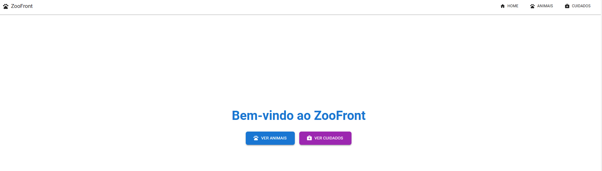
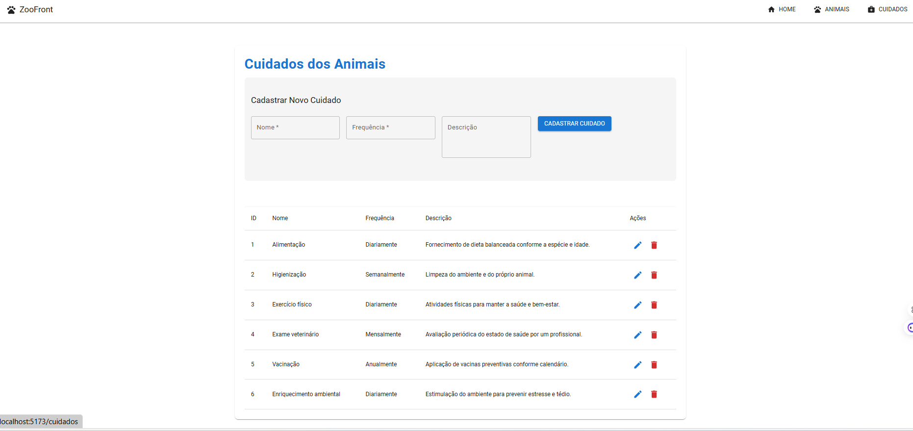
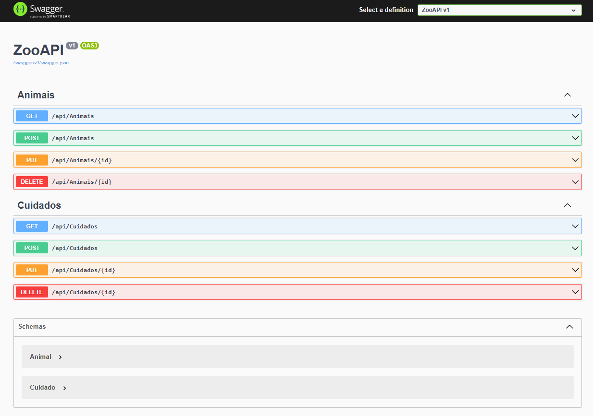

# 🐾 Sistema de Gerenciamento de Zoológico

## 📌 Descrição do Projeto
Este projeto é um sistema completo de gerenciamento de animais e seus cuidados em um zoológico, desenvolvido como parte de um desafio técnico. O sistema foi construído com uma arquitetura moderna e responsiva, dividida em:

- **Frontend**: Aplicação web com React e Material-UI  
- **Backend**: API RESTful desenvolvida com C# e .NET Core  
- **Banco de Dados**: SQL Server para armazenamento persistente dos dados

## 🎯 Objetivo
O sistema cumpre todos os requisitos propostos, incluindo:

- Cadastro completo de animais (nome, descrição, data de nascimento, espécie, habitat e país de origem)  
- Cadastro de cuidados (nome, descrição e frequência)  
- Operações completas de CRUD para animais e cuidados  
- Interface web responsiva e de fácil uso  
- Integração eficiente entre frontend e backend via API REST  

## 🛠️ Tecnologias Utilizadas

### Frontend
- React.js  
- Material-UI (MUI) para componentes visuais  
- Axios para comunicação com a API  
- React Hook Form para controle e validação de formulários  

### Backend
- .NET Core 6  
- Entity Framework Core (ORM)  
- Swagger para documentação interativa da API  
- SQL Server como banco de dados relacional  

## 🧗 Principais Desafios

### Primeira Experiência com C#/.NET
Este projeto marcou minha primeira experiência com C# e o ecossistema .NET. Os principais desafios enfrentados incluíram:

- Curva de aprendizado da linguagem e estrutura dos projetos .NET  
- Configuração do Entity Framework, migrations e relacionamentos entre entidades  
- Operações assíncronas e aplicação de boas práticas como injeção de dependência e arquitetura em camadas (Controllers, Services e Repositories)  

### Integração Frontend x Backend
- Configuração de CORS  
- Tratamento e formatação de dados, especialmente datas  
- Validações e mensagens de erro apropriadas para o usuário  

Superar esses desafios envolveu pesquisa contínua na documentação oficial, leitura de exemplos de projetos e muita prática com testes iterativos.

## 🚀 Funcionalidades Implementadas
- CRUD completo de animais e cuidados  
- Validações no frontend e backend  
- Filtros de busca e paginação de animais  
- Confirmações para exclusão de registros  
- Feedback visual com mensagens de sucesso, erro e carregamento  
- Interface amigável e responsiva  

## 📸 Screenshots

**Tela de listagem de animais:**  


**Formulário de cadastro de animais:**  


**Tela de cadastro de cuidados:**  


**Confirmação de exclusão:**  


## 🏁 Como Executar o Projeto

### Pré-requisitos
- Node.js (para o frontend)  
- .NET 6 SDK (para o backend)  
- SQL Server (local ou via Docker)  

### Backend
```bash
cd ZooManagementAPI
dotnet restore
dotnet ef database update
dotnet run
```

### Frontend
```bash
cd zoo-management-frontend
npm install
npm run dev
```

## 🔮 Melhorias Futuras
- Implementar autenticação e autorização  
- Adicionar upload de imagens para os animais  
- Criar dashboard com estatísticas e gráficos  
- Desenvolver testes unitários e de integração  
- Gerar relatórios com exportação para PDF/Excel  

## 🤝 Contribuições
Contribuições são bem-vindas!  
Sinta-se à vontade para abrir issues ou enviar pull requests com sugestões e melhorias.

## ✍️ Autor
Desenvolvido com ❤️ por Felipe Fortunato  
Desafio Técnico – CIEE/PR
